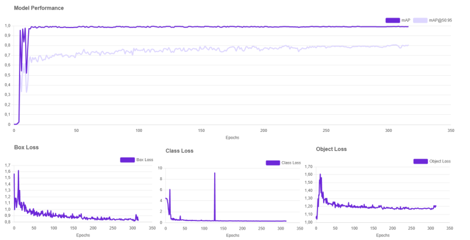
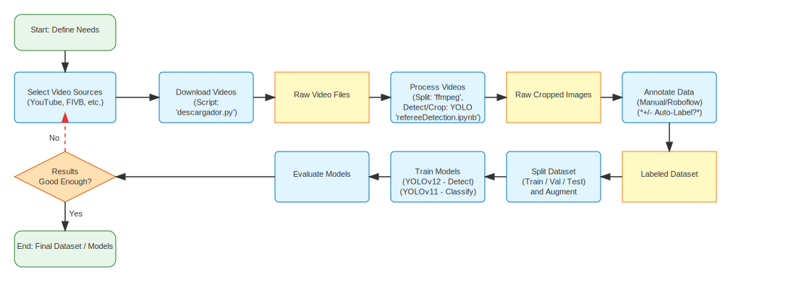

# Referee Detection System

A computer vision system designed to detect and track referees in sports videos using YOLO (You Only Look Once) object detection, with a focus on volleyball officiating and signal classification.

## Acknowledgments

This project has been developed in collaboration with the Real Federación Española de Voleibol (RFEVB), who granted permission for the use of their official match videos for AI training purposes. This collaboration has been crucial for the development and validation of the system.

## Training Dataset

The model has been trained using a carefully curated dataset of referee signals from official volleyball matches. The dataset includes the following signal classes:

| Signal Class | Image Count |
|--------------|-------------|
| Point (Left Arm) | 381 |
| Point (Right Arm) | 282 |
| Service Fault (Left Serve) | 185 |
| Service Fault (Right Serve) | 161 |
| Net Touch | 164 |
| Ball Outside | 113 |
| Four Hits | 52 |
| Ball Touched | 48 |
| **Subtotal (Listed Classes)** | **1,386** |

**Note:** The training images are currently private and not publicly available due to copyright restrictions. Access to the dataset requires explicit permission from the RFEVB.

## Training Metrics



**Explanation:**

- **Model Performance (mAP):**
  The top plot shows the evolution of the main performance metric: mAP (mean Average Precision), both overall and at an IoU threshold of 0.5, over 350 epochs. The model quickly reaches a high mAP and maintains it throughout training, indicating strong and stable detection and classification performance for referee signals.

- **Box Loss, Class Loss, Object Loss:**
  The three lower plots show the evolution of the loss values during model training. All losses decrease rapidly in the early epochs and stabilize at low values, with occasional spikes. This indicates that the model is learning effectively and converging well, with only minor fluctuations.

These metrics reflect that the model is able to effectively learn to detect and classify referee signals, achieving high and stable performance across a long training period.

## System Architecture



## Overview

This system processes video files to detect and track referees, creating segmented video clips that focus on the referee's movements. The system uses a trained YOLO model optimized for referee detection and includes features for video segmentation and processing. It represents a significant advancement in automated sports analysis technology.

## Key Features

- Real-time referee detection using YOLO model
- Video segmentation into configurable time intervals
- Automatic video processing pipeline
- GPU acceleration support (CUDA)
- Frame tracking and persistence
- Automatic file management for processed videos
- Temporal consistency mechanisms for robust video analysis
- Dual-model architecture for detection and classification tasks

## Research Contributions

### Technical Contributions
- A dual-model architecture that effectively separates detection and classification tasks
- Novel implementation of temporal consistency mechanisms for robust video analysis
- Empirical evaluation of data augmentation strategies for sports-specific gesture recognition
- Insights into precision-recall trade-offs in signal classification models

### Practical Applications
- Automated volleyball match analysis system
- Enhanced broadcast capabilities for all competition levels
- Foundation for automated graphics generation and statistics compilation
- Pathway toward comprehensive match analysis through unsupervised learning

## Impact

### Sports Broadcasting
- Reduces personnel requirements for professional-quality productions
- Enables comprehensive statistics and graphics for viewer engagement
- Makes advanced broadcast capabilities accessible to all competition levels
- Creates opportunities for new interactive viewing experiences

### Officiating and Analysis
- Provides consistent and objective recording of match events
- Enhances training resources for referees through automated signal analysis
- Generates comprehensive match statistics without manual data entry
- Identifies patterns and insights that might be missed in manual analysis

## Requirements

### System Requirements
- FFmpeg (required for video processing)
- CUDA-capable GPU (optional, for GPU acceleration)

### Python Dependencies
- Python 3.x
- OpenCV (cv2)
- PyTorch
- Ultralytics YOLO

## Installation

1. Install FFmpeg:
   - **Windows**: Download from [FFmpeg official website](https://ffmpeg.org/download.html) or install via Chocolatey:
     ```bash
     choco install ffmpeg
     ```
   - **Linux**:
     ```bash
     sudo apt update
     sudo apt install ffmpeg
     ```
   - **macOS**:
     ```bash
     brew install ffmpeg
     ```

2. Clone the repository:
```bash
git clone [repository-url]
cd RefereeDetection
```

3. Install the required Python dependencies:
```bash
pip install opencv-python torch ultralytics
```

## Project Structure

```
RefereeDetection/
├── src/
│   └── main.py           # Main processing script
├── models/
│   └── bestRefereeDetection.pt  # Trained YOLO model
├── data/
│   ├── input_videos/     # Directory for input videos
│   ├── processed_videos/ # Directory for processed output
│   └── used_videos/      # Directory for processed input files
└── README.md
```

## Usage

1. Place your input videos in the `data/input_videos` directory
2. Run the main script:
```bash
python src/main.py
```

The system will:
- Process each video file in the input directory
- Detect and track referees
- Create segmented output videos
- Move processed input files to the used_videos directory

## Configuration

The system can be configured through the following parameters in `main.py`:

- `DEVICE`: 'cuda' for GPU acceleration or 'cpu' for CPU processing
- `MODEL_SIZE`: Input size for the model (default: 640)
- `SEGMENT_DURATION`: Duration of video segments in seconds (default: 3600)
- `CONFIDENCE_THRESHOLD`: Detection confidence threshold (default: 0.7)

## Future Development

The system is designed to evolve toward:
- Unsupervised learning approaches for direct match event detection
- Enhanced viewer experiences through automated graphics generation
- More comprehensive match analysis capabilities
- Integration with broader sports technology ecosystems

## Contributing

Contributions are welcome! Please feel free to submit a Pull Request.

## License

This project is licensed under the MIT License. You are free to use, modify, and distribute this software, provided that the original copyright and license notice are included in all copies or substantial portions of the software.

See the LICENSE file for more details, or feel free to change the license to one that better fits your needs.

## Author

Pablo Fernandez
